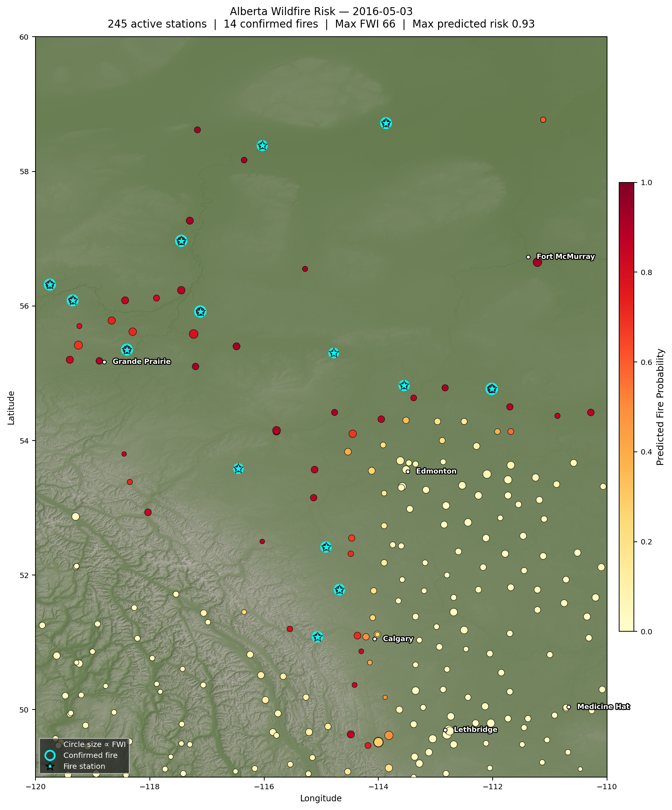

# Alberta Wildfire Prediction

Binary fire-occurrence classifier that predicts daily wildfire ignition risk at weather-station level across Alberta using Fire Weather Index data, historical fire records, land cover, and SRTM topography.

---

## Motivation

Alberta averages ~600 wildfires per year, burning millions of hectares and generating costs in the billions of dollars. The 2016 Fort McMurray fire alone displaced 88,000 people and caused $3.8 B in insured losses. Early, spatially explicit risk scores give fire managers a quantitative basis for pre-positioning resources — something rule-of-thumb FWI thresholds alone cannot provide. This project tests whether a machine-learning model trained on publicly available data can meaningfully improve on that baseline.

---

## Data Sources

| Dataset | Description | Source |
|---|---|---|
| CWFIS FWI CSVs (2000–2021) | Daily fire weather observations at ~470 Alberta stations | [Canadian Wildland Fire Information System](https://cwfis.cfs.nrcan.gc.ca/) |
| AB Historical Wildfire Records (2006–2025) | Fire perimeters and ignition points with lat/lon | [Alberta Wildfire Open Data](https://www.alberta.ca/wildfire-maps-and-data) |
| AB Land Cover 2020 (LULC) | 14-class, 10 m Sentinel-2 raster (EPSG:3400) | [AER DIG_2021_0019](https://www.alberta.ca/data-and-statistics) |
| SRTM3 90 m DEM | Elevation, slope, aspect tiles for Alberta | [CGIAR-CSI](https://srtm.csi.cgiar.org/) |

---

## Methodology

### Pipeline

```
cwfis_fwi*.csv  ──► preprocess.py ──► fwi_alberta_2000_2025.csv
                                              │
fp-historical-wildfire-data.csv ─────────────┤
AB_LULC_2020_10tm.tif ────────────────────── ├──► build_dataset.py ──► model_dataset.csv
srtm_alberta_topo.tif ────────────────────── │                              │
(download_dem.py)                             │                         train.py
                                                                             │
                                                                        explain.py
                                                                        map_risk.py
```

### Label construction

Positive samples (fire = 1) are created by spatially joining each historical ignition point to the nearest active FWI station on the fire date (±1 day window, ≤150 km). Negative samples are all remaining station-days with no nearby fire. This yields a 1:69 class imbalance.

### Feature engineering

- **Fire weather (14):** `temp`, `rh`, `ws`, `precip`, `ffmc`, `dmc`, `dc`, `isi`, `bui`, `fwi`, `month`, `day_of_year`, `lat`, `lon`
- **Land cover (1):** 14-class categorical from the 2020 Alberta LULC raster, sampled at each station location
- **Topography (4):** `elevation`, `slope`, `aspect_sin`, `aspect_cos` derived from SRTM3 DEM; aspect encoded as sin/cos to handle the 0°/360° discontinuity; flat-cell NaNs passed through to XGBoost's native missing-value handling

### Model

XGBoost binary classifier with temporal train/val/test split (train ≤ 2018, val = 2019, test 2020–21) to prevent data leakage. Class imbalance handled via `scale_pos_weight = neg / pos ≈ 64.6` rather than resampling, preserving the full 627,891-row training set. Early stopping on validation AUC (stopped at iteration 56 of 500).

**Key hyperparameters:** `max_depth=6`, `learning_rate=0.05`, `subsample=0.8`, `colsample_bytree=0.8`, `min_child_weight=10`

---

## Results

| Split | ROC-AUC | Avg Precision |
|---|---|---|
| Val (2019) | 0.9185 | 0.089 |
| **Test (2020–21)** | **0.9031** | 0.067 |

Low average precision reflects the extreme class imbalance (~1.4% fire rate); ROC-AUC is the primary metric given the operational framing (ranking stations by risk, not thresholding).

### SHAP feature importance (top 10)

| Rank | Feature | Mean \|SHAP\| | Interpretation |
|---|---|---|---|
| 1 | `lat` | 0.99 | North–south boreal/agricultural gradient dominates risk |
| 2 | `lon` | 0.75 | Foothills vs. interior contrast |
| 3 | `land_cover` | 0.26 | Coniferous and wetland-treed classes drive ignition |
| 4 | `elevation` | 0.22 | Higher terrain suppresses fire; montane vs. lowland signal |
| 5 | `day_of_year` | 0.19 | Within-season timing beyond coarse month |
| 6 | `ffmc` | 0.12 | Fine fuel moisture — strongest individual FWI index |
| 7 | `temp` | 0.09 | Independent signal beyond what FWI aggregates |
| 8 | `aspect_sin` | 0.06 | South-facing slopes dry faster |
| 9 | `dmc` | 0.06 | Duff moisture — subsurface drying |
| 10 | `month` | 0.04 | Coarse seasonal context |

The composite `fwi` index ranks 15th (SHAP 0.02) — the model extracts more signal from its constituent indices individually.

### Fort McMurray risk map — May 3, 2016

The model assigned a predicted risk of **0.93** to the station cluster near Fort McMurray on May 3, 2016 — two days before ignition of the 590,000-hectare beast fire. The northwest boreal corridor was clearly delineated as extreme risk while southeastern agricultural Alberta scored near zero, consistent with the land cover and FWI gradient the model learned.



---

## Limitations

- **Temporal data gap:** FWI data ends in May 2021; fire records extend to 2025. Post-2021 fire seasons (including the record 2023 season) are not represented in training or evaluation.
- **No lightning data:** Lightning ignition (~50% of Alberta fires by area) is a major missing predictor. Human-caused fires are matched to weather stations, but the underlying ignition mechanism is not modelled.
- **Spatial join assumptions:** Each fire is assigned to the single nearest active station within 150 km. Stations with no observation on the fire date fall back to ±1 day, introducing up to 24 hours of temporal noise in the features. Fires in data-sparse northern Alberta may be matched to distant stations with unrepresentative conditions.
- **Static land cover:** The 2020 LULC raster is applied across all years. Post-fire regeneration and land-use change between 2006 and 2020 are not captured.
- **Station-level, not pixel-level:** Predictions are at weather-station granularity (~30–100 km spacing). Sub-station spatial variation in fuel and topography is averaged away.

---

## Future Work

- **Ingest 2022–2025 FWI data** from CWFIS when available; retrain to capture the recent extreme seasons
- **Lightning strike density** (NALDN or AESO data) as an ignition-mechanism feature
- **Gridded prediction surface** via spatial interpolation or by switching to gridded ERA5 weather reanalysis (Copernicus CDS) instead of station observations
- **Temporal features:** rolling 7/14-day drought accumulation to capture antecedent dryness beyond DC/DMC
- **Threshold calibration:** Platt scaling or isotonic regression to produce calibrated probabilities suitable for operational dispatch decisions
- **SHAP interaction values** to quantify which land-cover × FWI combinations drive the highest marginal risk

---

## How to Run

### 1. Environment setup

```bash
pip install -r requirements.txt
```

Create a `.env` file at the project root with Copernicus CDS credentials (only needed for `climate.py`):

```
url=https://cds.climate.copernicus.eu/api
CDS_API_KEY=<your-key>
```

### 2. Download and preprocess FWI data

```bash
python preprocess.py        # clips CWFIS CSVs to Alberta bbox, merges decades
```

### 3. Download SRTM topography

```bash
python download_dem.py      # downloads 8 SRTM3 tiles via HTTPS, computes slope/aspect
```

### 4. Build the ML dataset

```bash
python build_dataset.py     # spatial join, land cover + topo sampling → model_dataset.csv
```

### 5. Train

```bash
python train.py             # temporal split, XGBoost, evaluation → outputs/wildfire_xgb.json
```

### 6. Explain

```bash
python explain.py           # SHAP beeswarm, bar, dependence plots → outputs/shap_*.png
```

### 7. Risk map

```bash
python map_risk.py          # hillshade map for 2016-05-03 → outputs/risk_map_2016-05-03.png
```

---

## Requirements

```
cdsapi>=0.7.7
pandas
numpy
xgboost
matplotlib
seaborn
scikit-learn
python-dotenv
rasterio
scipy
shap
elevation
requests
```

Python 3.10+ recommended. All raw data files (CSVs, NetCDF, rasters) are gitignored; the processed dataset and model weights are also excluded from version control.
